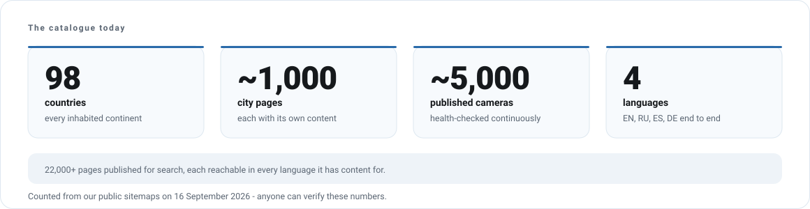

# Volve Vision - Public Updates

**What we are building, and what shipped when.**

---

Volve Vision runs a live camera platform: a catalogue of public webcams from around the world,
the apps people watch them in, and the tools venues and camera owners use on top of it.

This repository is the public record of that work. Every month we publish what shipped, in plain
language, so that anyone following the company can see the direction and the pace without needing
access to anything private.

**This repository contains no source code and no infrastructure detail.** It describes outcomes,
not internals. See [what we publish](docs/what-we-publish.md) for the reasoning.

---

## The products

<picture>
  <source media="(prefers-color-scheme: dark)" srcset="assets/diagrams/product-map-dark.svg">
  
</picture>

| Product | What it is | Status | Detail |
|---|---|---|---|
| **Web platform** | The live camera catalogue, maps, editorial and accounts at [volvevision.com](https://volvevision.com) | Live | [History](products/web-platform.md) |
| **Mobile apps** | iOS and Android clients for watching, saving and submitting cameras | Live (iOS), Android in release prep | [History](products/mobile-apps.md) |
| **VolveMenu** | Digital menu boards for cafes, bars and retail, managed from a phone | Live with first venues | [History](products/volvemenu.md) |
| **Video analytics** | Counting and detection on top of camera feeds, for business use | In development | [Detail](products/video-analytics.md) |
| **Operations console** | Internal moderation, publishing and quality tooling | Live, internal only | [History](products/operations-console.md) |
| **Brand and 3D** | Identity, mascot and the visual language across every surface | Ongoing | [Detail](products/brand.md) |

---

## The catalogue today

<picture>
  <source media="(prefers-color-scheme: dark)" srcset="assets/diagrams/catalogue-dark.svg">
  
</picture>

These numbers come from our public sitemaps and can be verified by anyone, at any time, without
our help. We publish catalogue scale only. We do not publish traffic, revenue or user counts here.

---

## How we got here

<picture>
  <source media="(prefers-color-scheme: dark)" srcset="assets/diagrams/timeline-dark.svg">
  
</picture>

The first generation of Volve Vision apps was built in 2022. The current platform is a complete
rebuild that started in December 2025 and has been in continuous delivery since.

---

## Where we are heading

<picture>
  <source media="(prefers-color-scheme: dark)" srcset="assets/diagrams/roadmap-dark.svg">
  
</picture>

Full detail, including what each column means: [ROADMAP.md](ROADMAP.md).

> [!NOTE]
> Anything describing future work is a statement of intent, not a promise. Plans change as we learn.

---

## Reading the updates

| If you want | Read |
|---|---|
| The short version, everything at once | [CHANGELOG.md](CHANGELOG.md) |
| What happened in a given month | [updates/](updates/README.md) |
| One product's full history | [products/](products/README.md) |
| What we plan to do | [ROADMAP.md](ROADMAP.md) |
| How versions and releases are numbered | [docs/versioning.md](docs/versioning.md) |
| Why some detail is missing | [docs/what-we-publish.md](docs/what-we-publish.md) |
| To report a security issue | [SECURITY.md](SECURITY.md) |

### Recent months

- [September 2026](updates/2026/2026-09.md) - account security across every client, catalogue reliability, search visibility
- [August 2026](updates/2026/2026-08.md) - VolveMenu goes live, German becomes the fourth full language
- [July 2026](updates/2026/2026-07.md) - the mobile apps take shape
- [Full index](updates/README.md)

---

Volve Vision · [volvevision.com](https://volvevision.com) · updates published monthly

