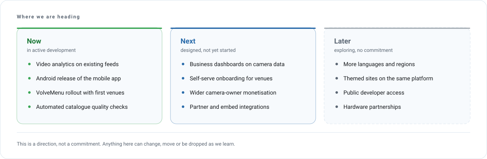

# Roadmap

<picture>
  <source media="(prefers-color-scheme: dark)" srcset="assets/diagrams/roadmap-dark.svg">
  
</picture>

> [!IMPORTANT]
> Everything on this page describes intent, not commitment. Items move between columns, change
> shape, or get dropped when what we learn says they should. Nothing here is a delivery promise,
> and no date should be inferred from position.

## What the columns mean

| Column | Meaning | Confidence |
|---|---|---|
| **Now** | Being built right now, by someone, this month | High. Expect to see it in monthly updates |
| **Next** | Decided and designed, waiting on capacity or on something in Now | Medium. Shape may still change |
| **Later** | Being explored. We think it matters, we have not committed | Low. Treat as direction only |

---

## Now

**Video analytics on existing feeds.**
Counting and detection that runs on camera feeds we already carry, so a business can get numbers
out of a camera it already owns. In development, not yet available to customers.

**Android release of the mobile app.**
The iOS app is live. The Android build exists and is being prepared for store release.

**VolveMenu rollout with first venues.**
The product is live and running in real venues. The work now is onboarding, templates and the
operational edges that only show up with real customers.

**Automated catalogue quality checks.**
Cameras go offline, change address or degrade quietly. Making detection and recovery automatic
protects both the viewer experience and the catalogue's standing in search.

## Next

**Business dashboards on camera data.**
The analytics layer produces numbers. This turns them into something a non-technical operator
reads daily.

**Self-serve onboarding for venues.**
Today a venue is set up with our help. The intent is for a venue to do it alone, in an evening.

**Wider camera-owner monetisation.**
Owners can already publish and earn. There is more to do on placement, reporting and payout clarity.

**Partner and embed integrations.**
Letting other sites carry our cameras, properly attributed, with the quality guarantees intact.

## Later

**More languages and regions.**
Four languages are live end to end. Each additional one is a real commitment across site, apps,
email and content, so we add them deliberately rather than quickly.

**Themed sites on the same platform.**
The platform already runs more than one public site. Whether that becomes a line of business is
an open question.

**Public developer access.**
Frequently asked for. Needs a sustainable shape before it can exist.

**Hardware partnerships.**
Cameras, screens and the bundles around them. Exploratory.

---

## What is deliberately not here

- Anything we have decided against. A roadmap that only grows is a wish list.
- Internal engineering work with no outside effect. It shows up in monthly updates instead.
- Dates. We publish what shipped, after it ships.

Progress against this roadmap appears in the [monthly updates](updates/README.md).
