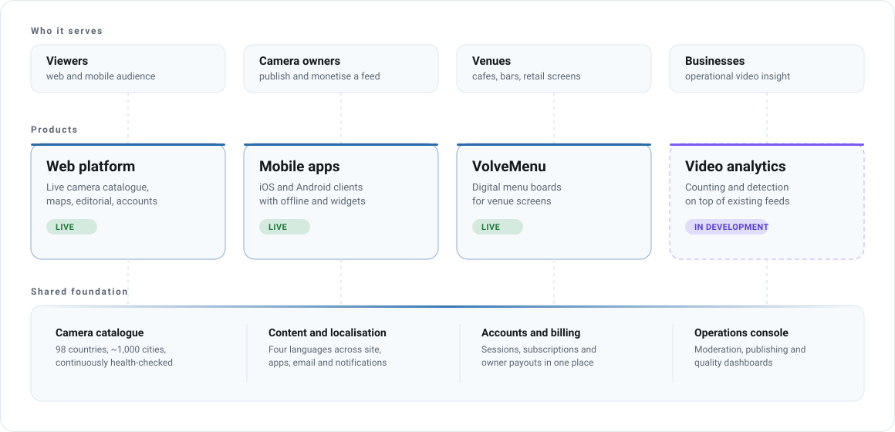

# Products

Six surfaces, one platform. Each file below is the full public history of one of them.

| Product | Audience | Status | Since |
|---|---|---|---|
| [Web platform](web-platform.md) | Viewers, camera owners | Live | April 2026 |
| [Mobile apps](mobile-apps.md) | Viewers, camera owners | Live on iOS, Android in release prep | July 2026 |
| [VolveMenu](volvemenu.md) | Venues | Live with first venues | August 2026 |
| [Video analytics](video-analytics.md) | Businesses | In development | 2026 |
| [Operations console](operations-console.md) | Internal | Live, internal only | May 2026 |
| [Brand and 3D](brand.md) | Everyone | Ongoing | 2022, rebuilt 2026 |

<picture>
  <source media="(prefers-color-scheme: dark)" srcset="../assets/diagrams/product-map-dark.svg">
  
</picture>

Monthly detail across all products: [updates/](../updates/README.md).
