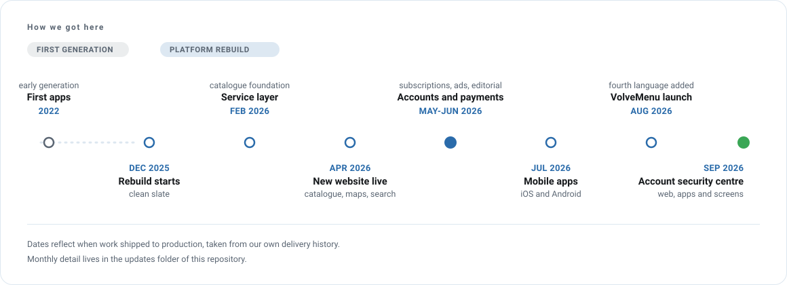

# Monthly updates

Every month, what shipped. Newest first. Format and categories are described in
[docs/versioning.md](../docs/versioning.md).

## 2026

| Month | Release | What it was about |
|---|---|---|
| [September](2026/2026-09.md) | `2026.09` | Account security on every client; a flapping source stops looking like dead cameras |
| [August](2026/2026-08.md) | `2026.08` | VolveMenu ships end to end; German becomes a full language |
| [July](2026/2026-07.md) | `2026.07` | The mobile apps, nothing to complete in one month |
| [June](2026/2026-06.md) | `2026.06` | Editorial, content production at catalogue scale, moderation |
| [May](2026/2026-05.md) | `2026.05` | Accounts, subscriptions, payments, owner monetisation |
| [April](2026/2026-04.md) | `2026.04` | The new website goes live |
| [March](2026/2026-03.md) | `2026.03` | Recording, notifications, first landing page |
| [February](2026/2026-02.md) | `2026.02` | The foundation of the rebuild |

## Earlier

| Period | What it was about |
|---|---|
| [Q4 2025](2025/2025-q4.md) | The decision to rebuild |
| [2022 to 2023](2022/2022-2023.md) | The first generation |

---

<picture>
  <source media="(prefers-color-scheme: dark)" srcset="../assets/diagrams/timeline-dark.svg">
  
</picture>
